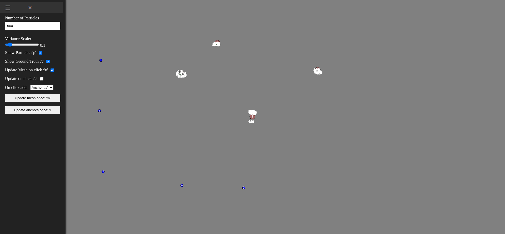
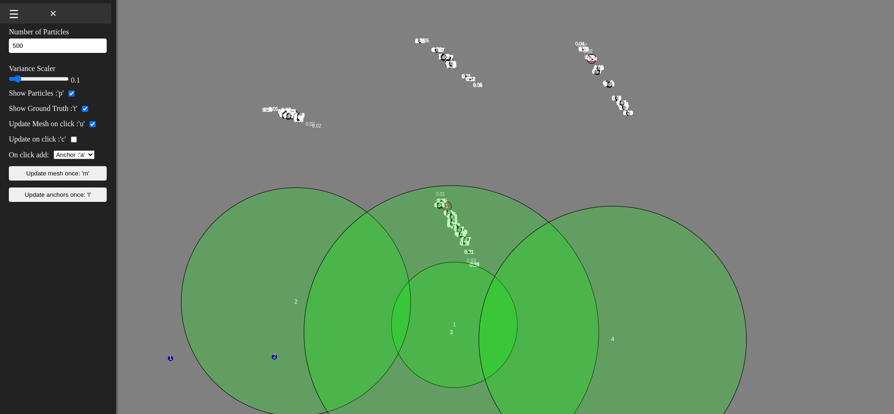
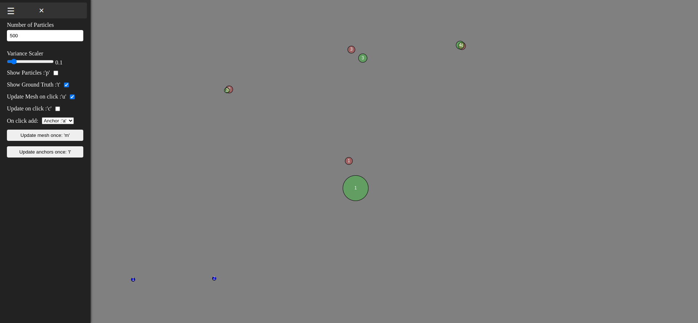
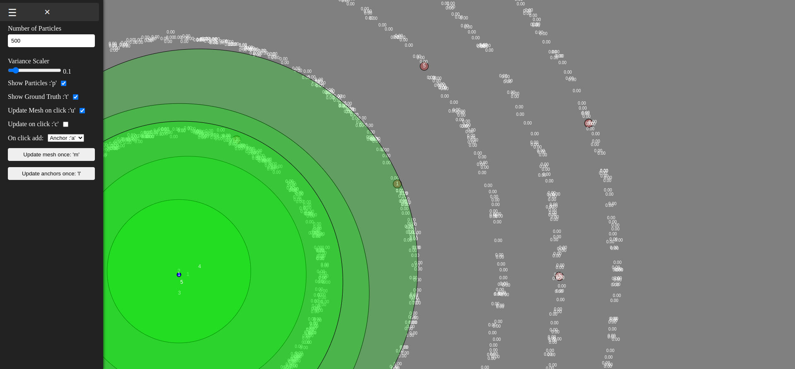
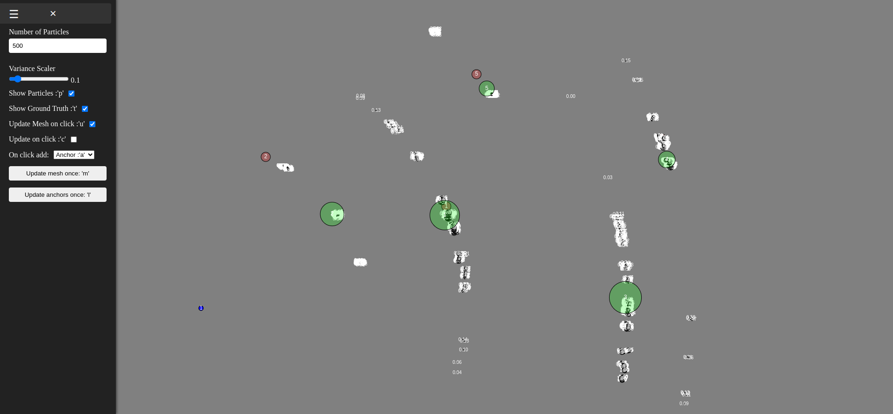
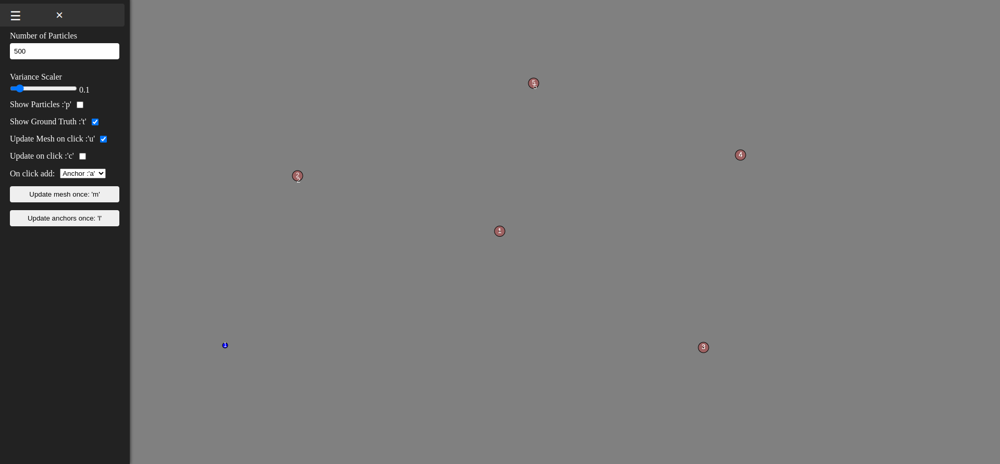

# ParticuleFilterWeb

This is a demo of a particule filter algorithm running in a web browser. It showcases a simple strategy for estimating the position of nodes using only ranging from either anchors or other nodes. For a valid solution to be found, at least 1 anchor update is needed.

## how to 

To run the demo, simply access the following link: [https://colvertyety.github.io/ParticuleFilterWeb/](https://colvertyety.github.io/ParticuleFilterWeb/). 

By clicking on the canvas, you can add nodes and anchors. The anchors are represented by blue circles and the anchors by red circles. The particules are represented by small black circles and white numbers. 
Anchors have a low ranging variance and a known position. 
The Variance and estimated position of the nodes can be seen with the green circles. The larger they are, the larger the uncertainty of their position. The menu that unfolds from the left allows you to mess around with some parameters. 

You can change the number of particules for each node as well as the variance scale to see how it affects the convergence of the filter.

You can also affect the display style by removing the particules, or the ground truth position of the nodes and anchors.

## simple example

In a simple case where the anchors are placed in a orthogonal fashion, the particule filter converges to the correct position of the nodes after only 1 anchor update.

## complex example

a more complex situation occurs when the anchors are placed in a non-orthogonal fashion.

To solve this, after 1 anchor update, a node updates can be used to converge to the correct position. Updating from node rangings requires a low enough variance in the particules to converge to the correct position.

## single anchor example

In the case where only 1 anchor is available, the particule filter can still converge to the correct position of the nodes by using the correct update strategy.

1. Start with a single anchor update:

2. Update from the node:

3. repeat the node  and anchor updates until the particules converge to the correct position:

